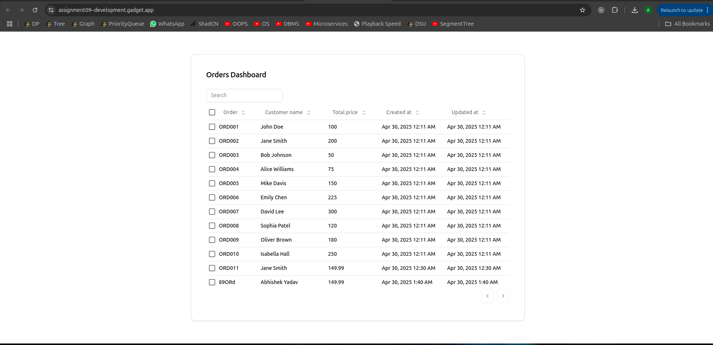
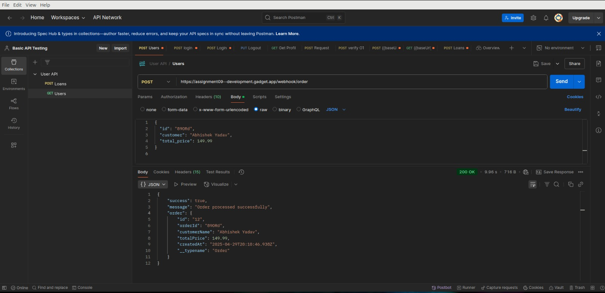

# 📱 Shopify Order Notification System

This app demonstrates a simple yet effective system for managing Shopify orders, showcasing how to add orders, store them, and display their details in a user-friendly table interface.

## Screenshots

### Orders Table



### Postman



## 🚀 Features

- ✅ **Webhook Integration**: Receives simulated Shopify order webhooks through a public API endpoint
- 💾 **Data Storage**: Persists essential order information in a database
- 👁️ **Visual Dashboard**: Displays incoming orders in a clean, responsive interface
- 📊 **Future Ready**: Foundation for WhatsApp notification delivery

## 📋 Setup Instructions

### Step 1: Create Your Gadget.dev Application

1. Sign in to [Gadget.dev](https://gadget.dev)
2. Click "New Application"
3. Name your application (e.g., "shopify-order-notifications")
4. Select the blank template to start from scratch

### Step 2: Configure the Data Model

Create an **Order** model with the following fields:

| Field Name     | Type   | Description                                             |
| -------------- | ------ | ------------------------------------------------------- |
| `orderId`      | String | Unique identifier for the order                         |
| `customerName` | String | Name of the customer who placed the order               |
| `totalPrice`   | Number | Total amount of the order                               |
| `createdAt`    | Date   | Auto-generated timestamp of when the order was received |

### Step 3: Implement the Webhook Endpoint

1. Create a new Action named `receiveWebhook`
2. Configure it to process incoming webhook payloads
3. Set up the route: `/webhook/order`
4. Implement validation for required fields
5. Connect the action to store validated data in the Order model

```javascript
// Example Action Implementation
import { RouteHandler } from "gadget-server";

/**
 * Webhook endpoint for receiving simulated Shopify order data
 * @type {RouteHandler}
 */
const route = async ({ request, reply, api, logger }) => {
  try {
    const payload = request.body;

    logger.info("Received order webhook payload", { orderId: payload.id });

    if (!payload.id) {
      logger.error("Missing required field 'id' in webhook payload");
      return reply.code(400).send({
        error: "Bad Request",
        message: "Missing required field: id",
      });
    }

    if (!payload.customer) {
      logger.error("Missing required field 'customer' in webhook payload");
      return reply.code(400).send({
        error: "Bad Request",
        message: "Missing required field: customer",
      });
    }

    if (payload.total_price === undefined || payload.total_price === null) {
      logger.error("Missing required field 'total_price' in webhook payload");
      return reply.code(400).send({
        error: "Bad Request",
        message: "Missing required field: total_price",
      });
    }

    const orderData = {
      orderId: payload.id.toString(),
      customerName: payload.customer,
      totalPrice: Number(payload.total_price),
    };

    const result = await api.order.create(orderData, {
      select: {
        id: true,
        orderId: true,
        customerName: true,
        totalPrice: true,
        createdAt: true,
      },
    });

    logger.info("Successfully created order record", {
      gadgetOrderId: result.id,
      shopifyOrderId: payload.id,
    });

    return reply.code(200).send({
      success: true,
      message: "Order processed successfully",
      order: result,
    });
  } catch (error) {
    logger.error("Error processing order webhook", {
      error: error.message,
      stack: error.stack,
    });

    return reply.code(500).send({
      error: "Internal Server Error",
      message: "Failed to process the order",
      details: error.message,
    });
  }
};

route.options = {
  schema: {
    body: {
      type: "object",
      properties: {
        id: { type: "string" },
        customer: { type: "string" },
        total_price: { type: ["string", "number"] },
      },
      required: ["id", "customer", "total_price"],
    },
  },
};

export default route;
```

## 🧪 Testing Your Implementation

Send a test webhook using your preferred API client (cURL, Postman, etc.):

```bash
curl -X POST https://assignment09--development.gadget.app/webhook/order \
  -H "Content-Type: application/json" \
  -d '{
    "id": "89ORd",
    "customer": "Abhishek Yadav",
    "total_price": 149.99
  }'
```

### Sample Payload:

```json
{
  "id": "89ORd",
  "customer": "Abhishek Yadav",
  "total_price": 149.99
}
```

After sending the request, verify the order appears in your Gadget.dev application interface.

## 📝 Implementation Notes

- **Webhook Handling**: The system only accepts POST requests with JSON payloads
- **Field Validation**: The implementation performs checks for required fields before saving
- **Simplicity First**: No actual Shopify or WhatsApp integration is required at this stage
- **Error Handling**: Graceful handling of malformed requests with appropriate status codes

---

<p align="center">
  <small>Built with ❤️ using Gadget.dev</small>
</p>
